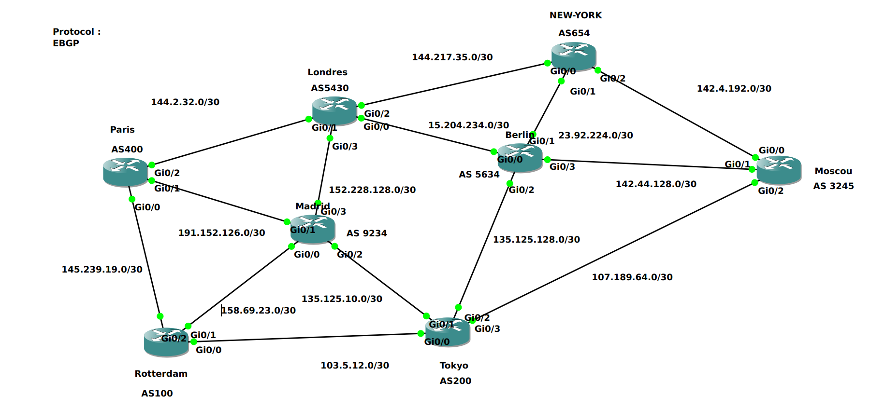
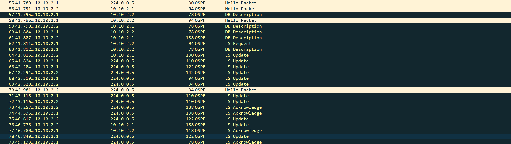
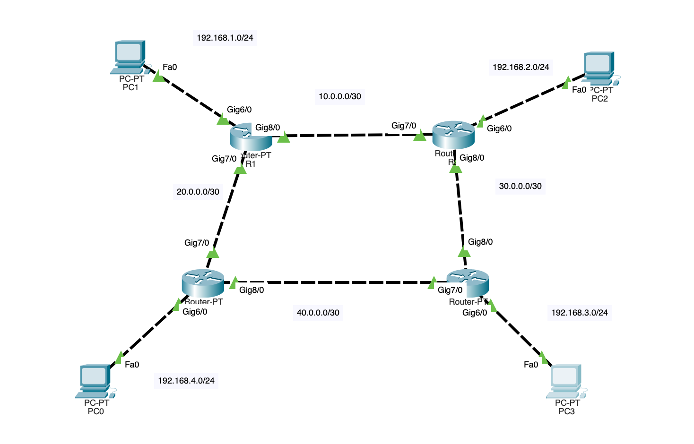
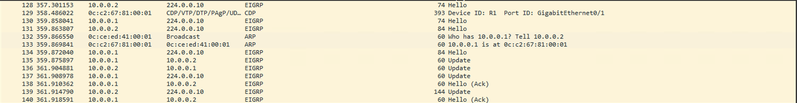

# Protocoles de routage


## Protocole BGP


### Présentation

- Standard (Interopérable), utilisable entre différents fournisseurs
- Utilisé pour le réseau internet mondiale
- Routage entre AS (Autonomous System)
- Utiliser pour des très grands réseaux


### Caractéristiques

- BGP fait partie de la famille des protocoles à facteur de distance, c'est un EGP (External Gateway Protocol). C'est d'ailleurs le seul à l'heure actuel à en faire parti.
- Il a également 2 sous-catégories:
  - EBGP (BGP Externe)
  - IBGP (BGP Interne)
- Protocole à vecteur de  distance (path vector): Il choisira la meilleure route pour atteindre la destination en fonction du chemin en prenant en compte le nombre de saut, la vitesse des liens ...
- Utilise le procole TCP en port 179
- La convergence sur un réseau comme BGP est très lente
- Les MAJ de routage sont envoyés uniquement quand une modification est effectuée et seul les changements sont envoyés.


### Déploiement

- Pour établir les liens entre les voisins, il faut renseigner manuellement l'ip de l'interface du routeur voisins (le prochain saut). Contrairement à d'autres protocoles où la relation de voisinage se fait dynamiquement. **Une particularité avec BGP, c'est que le voisin n'est pas obligatoirement relié directement avec lui. Il  peut y avoir beaucoup de routeurs configurés avec un autre protocole entre les 2, il faut seulement que les 2 puissent se joindre.**.

**Fonctionnement d'une connexion**:

- **IDLE** : Demande d'ouverture de session effectuée. Une fois la connexion initiée, le routeur passe en mode <u>Connect</u> pour attendre la réponse du routeur voisin

- **Connect** : Le routeur attend une réponse (TCP Syn-Ack) du voisin. Les 2 routeurs vont effectué le même travail, mais une seule session sera prise en compte en fonction du routeur qui a l'ID le plus élevé. 
- **Active** (facultatif) : Tentative de connexion échoué avec le voisin, nouvelle tentative. En cas d'échec total, le routeur repasse en mode IDLE. Ce status est atteint qu'en cas d'échec en mode connect.
- **Open sent** : Un message open est envoyé. Celui-ci contient plusieurs informations (version BGP, ID routeur, numéro AS, Hold Down Timer). Lorsque le voisin réceptionne le message, il vérifie que tout est valide. Si c'est le cas alors il envoie un KeepAli_ve et passe en **Open Confirm**.
- **Open Confirm** : Attente du keepalive du voisin, avant de passer en Established.
- **Established** : La relation de voisinage est établie. Les routeurs peuvent s'échanger des routes.


### Configuration

Le prérequis pour que BGP fonctionne par la suite, c'est que chaque routeurs qui doivent être joignable en BGP soient configurés avec un autre protocole de routage interne ou via du routage statique pour qu'ils puissent dans un premier temps se joindre. Cette étape est nécessaire afin que la relation de voisinage bgp fonctionne. J'ai mis en place la topologie suivante, j'ai configuré chacune des interfaces et chaque routeur en OSPF.

Dans cet exemple, j'ai configuré seulement Paris et Moscou avec un tunnel BGP pour qu'ils puissent se joindre directement.



Etape 1: Configurer une interface loopback sur Paris. Comme adresse de loopback j'ai repris l'id du routeur configuré dans ospf 4444 puisque l'AS de paris est 400. Il est évidemment possible de mettre absolument ce que l'ont veut.

```
Paris(config)#int lo0
Paris(config-if)#ip address 4.4.4.4 255.255.255.255
Paris(config-if)#no shut
```

Ensuite il va falloir rajouter ce réseau dans la LSDB OSPF. 

```
Paris(config-if)#router ospf 1
Paris(config-router)#network 4.4.4.4 0.0.0.0 area 0
```

Et faire la même chose sur Moscou

```
Moscou(config)#int lo0
Moscou(config-if)#ip address 3.2.4.5 255.255.255.255
Moscou(config-if)#no shut
Moscou(config-if)#router ospf 1
Moscou(config-if)#network 3.2.4.5 0.0.0.0 area 0
```

**Il faut bien vérifier à partir de là si les routeurs sont joignables via leurs vraies interfaces, dans ce cas sur les réseaux en /30 via OSPF. Une fois vérifié la configuration BGP est possible**

***Paris***

```
Paris(config)#router bgp 400
Paris(config-router)#neighbor 3.2.4.5 remote-as 3245
Paris(config-router)#neighbor 3.2.4.5 update-source loopback 0
Paris(config-router)#neighbor 3.2.4.5 ebgp-multihop 10
```

***Moscou***

```
Moscou(config-if)#router bgp 3245
Moscou(config-router)#neighbor 4.4.4.4 remote-as 400
Moscou(config-router)#neighbor 4.4.4.4 update-source loopback 0
Moscou(config-router)#neighbor 4.4.4.4 ebgp-multihop 4
```


## Protocole OSPF

Multicast Address : 224.0.0.5 / 224.0.0.6

Port : 89 (TCP)

Hello Time : 10s (Default)


### Introduction

OSPF (Open Shortest Path First) est un protocol à état de lien. Protocole ouvert (disponible sur d'autres équipements que Cisco).

Il fonctionne sous un système de zone. Chaque zone ospf est utilisé pour identifier le réseau de ce dernier.

Lorsque un routeur est configuré dans 2 zones ou plus, il est appelé **ABR**(Area Border Router).

Si un routeur est configuré dans plus d'un domaine de routage avec d'autres protocoles, il est appelé **ASBR**(Autonomous System Border Routers)

### Mise en place

Pour configurer le routage OSPF sur un routeur ou switch backbone (niveau 3), il va falloir d'abord configurer manuellement chacune des interfaces de l'équipement en statique. Puis activer l'ospf comme ceci:

```python
R1(config)# router opsf 1 (On active le routage en spécifiant l'id du processus, ce numéro est totalement aléatoire)
R1(config-router)# router-id 1.1.1.1 (on spécifie l'id du routeur)
```

Il n'est pas obligatoire de renseigner l'id du routeur, par défaut il prendra l'adresse la plus élevé sur les interfaces loopback, si aucune interfaces loopback configuré, il prendra celle des interfaces physique.

 Puis on renseigne les réseaux directement connecté au routeur. Attention, ici le masque de sous-réseau doit être écrit au format wildcard (inversé)

```
R1(config-router)# network 192.168.1.0 0.0.0.255 area 0 => Masque /24 255.255.255.0
R1(config-router)# network 10.10.1.0 0.0.0.3 area 0 => Masque /30 255.255.255.252
R1(config-router)# network 10.10.2.0 0.0.0.3 area 0
```

Dans l'exemple ci-dessus, il y a le réseau lan 192.168.1.0, afin d'éviter que le routeur cherche ce réseau ailleurs, il faut saisir la commande suivante:

```
R1(config-router)# passive interface <int interne> (exemple: f0/3)
```

Maintenant je vais afficher les informations sur les voisins ospf

```
R1#show ip ospf neighbor

Neighbor ID     Pri   State           Dead Time   Address         Interface
3.3.3.3           1   FULL/BDR        00:00:30    10.10.2.2       GigabitEthernet0/0
2.2.2.2           1   FULL/BDR        00:00:35    10.10.1.2       GigabitEthernet0/1
```

Lorsque le protocole détecte ses voisins, il doit les stockers dans une base de donnée nommée (LSDB: link state database). Les infos reçu par OSPF s'appellent des LSA (Link State Advertisment)

```
R1#show ip ospf database

            OSPF Router with ID (1.1.1.1) (Process ID 1)

		Router Link States (Area 0)

Link ID         ADV Router      Age         Seq#       Checksum Link count
1.1.1.1         1.1.1.1         66          0x80000009 0x00F646 3
2.2.2.2         2.2.2.2         255         0x80000005 0x00852A 2
3.3.3.3         3.3.3.3         248         0x80000004 0x005B4C 2

		Net Link States (Area 0)

Link ID         ADV Router      Age         Seq#       Checksum
10.10.1.1       1.1.1.1         328         0x80000001 0x00E531
10.10.2.1       1.1.1.1         267         0x80000001 0x000D05
10.10.3.2       2.2.2.2         255         0x80000001 0x00FB0C
```

Pour nettoyer la LSDB nous utilisons la commande :

```
R1# clear ip ospf processus
```

Voici à quoi ressemble sur wireshark les communications OSPF



Pour afficher la table de routage OSPF

```
R1#show ip route ospf
Codes: L - local, C - connected, S - static, R - RIP, M - mobile, B - BGP
       D - EIGRP, EX - EIGRP external, O - OSPF, IA - OSPF inter area 
       N1 - OSPF NSSA external type 1, N2 - OSPF NSSA external type 2
       E1 - OSPF external type 1, E2 - OSPF external type 2
       i - IS-IS, su - IS-IS summary, L1 - IS-IS level-1, L2 - IS-IS level-2
       ia - IS-IS inter area, * - candidate default, U - per-user static route
       o - ODR, P - periodic downloaded static route, H - NHRP, l - LISP
       a - application route
       + - replicated route, % - next hop override, p - overrides from PfR

Gateway of last resort is not set

      10.0.0.0/8 is variably subnetted, 5 subnets, 2 masks
O        10.10.3.0/30 [110/2] via 10.10.2.2, 00:04:29, GigabitEthernet0/0
                      [110/2] via 10.10.1.2, 00:04:29, GigabitEthernet0/1
```

## Protocole RIP

BROADCAST ADDRESS : **224.0.0.9**

PORT: **UDP 520**

Update Time : 30s (default)

## Protocole EIGRP

BROADCAST ADDRESS: 224.0.0.10

PORT: 

Internal Administrative Distance : 90

External Administrative Distance : 170

Enhanced Interior Gateway Routing Protocol est un protocol propriétaire Cisco. C'est un protocol de routage à vecteur de distance, il utilise l'algorithme DUAL (Diffusing Update Algorithme) comme "Loop Free Routing". Toutes les 15 secondes, le protocole envoit à l'adresse multicast 224.0.0.10 un paquet hello pour détecter ses voisins eigrp et s'assurer que ceux qui sont connus soit toujours actifs, on appelle ça le hello-time. Une fois qu'il reçoit un autre paquet hello quand le protocole est activé sur le voisin, il va recevoir un paquet update pour mettre à jour sa table de routage.

### Configuration

Pour établir la relation de voisinage EIGRP, il faut configurer les interfaces de chaque routeurs puis rentrer dans le processus eigrp pour ajouter les réseaux de chaque interfaces:



R1 : G6/0 -> 192.168.1.1/24 
	G7/0 -> 20.0.0.2/30	
	G8/0 -> 10.0.0.1/30

R2: G6/0 -> 192.168.2.1/30
	G7/0 -> 10.0.0.2/30
	G8/0 -> 30.0.0.1/30

R3: G6/0 -> 192.168.3.1/24
	G7/0 -> 40.0.0.1/30
	G8/0 -> 30.0.0.2/30

R4: G6/0 -> 192.168.4.0/24
	G7/0 -> 20.0.0.1/30
	G8/0 -> 40.0.0.2/30

```
R1(config)# router eigrp 100
R1(config-router)#network 192.168.1.0
R1(config-router)#network 10.0.0.0
R1(config-router)#network 40.0.0.0
```

Il peut-être utile de désactiver l'auto-summary comme ceci :

```
R1(config-router)# no auto-summary
```

Cette fonctionnalité permet d'alléger les tables de routages en créant un préfix des réseaux connus par le protocole mais par conséquent peux masquer des informations détaillés sur les routes eigrp

La capture suivante affiche les communications d'eigrp avec un paquet "Hello" qui permet d'initier la détection des voisins ensuite un paquet update pour mettre à jour sa table de routage et l'acquittement pour "accusé de réception" aux voisins.



Pour voir la topology saisir la commande suivante :

```
R1#show ip eigrp topology
IP-EIGRP Topology Table for AS 100/ID(192.168.1.1)

Codes: P - Passive, A - Active, U - Update, Q - Query, R - Reply,
       r - Reply status

P 10.0.0.0/30, 1 successors, FD is 2816
         via Connected, GigabitEthernet8/0
P 20.0.0.0/30, 1 successors, FD is 2816
         via Connected, GigabitEthernet7/0
P 30.0.0.0/30, 1 successors, FD is 3072
         via 10.0.0.2 (3072/2816), GigabitEthernet8/0
P 40.0.0.0/30, 1 successors, FD is 3072
         via 20.0.0.2 (3072/2816), GigabitEthernet7/0
P 192.168.1.0/24, 1 successors, FD is 5120
         via Connected, GigabitEthernet6/0
P 192.168.2.0/24, 1 successors, FD is 5376
         via 10.0.0.2 (5376/5120), GigabitEthernet8/0
P 192.168.3.0/24, 2 successors, FD is 5632
         via 20.0.0.2 (5632/5376), GigabitEthernet7/0
         via 10.0.0.2 (5632/5376), GigabitEthernet8/0
P 192.168.4.0/24, 1 successors, FD is 5376
         via 20.0.0.2 (5376/5120), GigabitEthernet7/0
```

Pour voir les routes :

```
R1#show ip eigrp topology
IP-EIGRP Topology Table for AS 100/ID(192.168.1.1)

Codes: P - Passive, A - Active, U - Update, Q - Query, R - Reply,
       r - Reply status

P 10.0.0.0/30, 1 successors, FD is 2816
         via Connected, GigabitEthernet8/0
P 20.0.0.0/30, 1 successors, FD is 2816
         via Connected, GigabitEthernet7/0
P 30.0.0.0/30, 1 successors, FD is 3072
         via 10.0.0.2 (3072/2816), GigabitEthernet8/0
P 40.0.0.0/30, 1 successors, FD is 3072
         via 20.0.0.2 (3072/2816), GigabitEthernet7/0
P 192.168.1.0/24, 1 successors, FD is 5120
         via Connected, GigabitEthernet6/0
P 192.168.2.0/24, 1 successors, FD is 5376
         via 10.0.0.2 (5376/5120), GigabitEthernet8/0
P 192.168.3.0/24, 2 successors, FD is 5632
         via 20.0.0.2 (5632/5376), GigabitEthernet7/0
         via 10.0.0.2 (5632/5376), GigabitEthernet8/0
P 192.168.4.0/24, 1 successors, FD is 5376
         via 20.0.0.2 (5376/5120), GigabitEthernet7/0
```

## ACL (Access Control List)

Les ACL sont des mécanismes avancés permettant d'ajouter des contrôles d'accès en appliquant des règles de filtrage au niveau de l'entête IP. Elles peuvent filtrer un paquet au niveau de l'adresse IP source / destination et au niveau des protocoles de niveau 3/4. Elles sont aussi utilisées pour mettre en place des VPN, faire du NAT.

1 ACL = 1 ou N ACE (Liste d'instructions lues par le routeur).

ACE = Commande IOS commencant par access-list ou ip access-list.

Il faut savoir qu'une ACL vide, bloquera par défaut tout le traffic.

##### <u>PETIT RAPPEL SUR LE WILDCARD</u>

La méthode rapide pour calculer un masque inversé, c'est de soustraire 255 par le masque de sous-réseau complet. Exemple pour un /21 le masque étant 255.255.248.0 ce qui donne : <u>**255.255.255.255 - 255.255.248.0 = 0.0.7.255**</u>.

A savoir avant d'appliquer une ACL, il faut prendre en compte la règle des 3 P :

- Une ACL par protocole (IPv4, IPv6)
- une ACL par direction (Entrant ou Sortant)
- Une ACL par interface (g0/1)

### Standard

Les acls standard sont prévu pour agir le plus proche de la destination

Voici comment les appliquer :

```
R1(config)# access-list 1 permit <network> <mask>
R1(config)# access-list 1 permit host <ip>
R1(config)# access-list 1 deny <network> <mask>
R1(config)# access-list 1 deny any
R1(config)# interface <number> (La plus proche de la destination)
R1(config-if)# ip access-group 1 out
```

### Etendue

Les acls étendues sont prévu pour agir le plus proche de la source

Exemple:

Dans le cas où il un pc qui est connecté à un routeur opposé à celui qui sort de la zone backbone, les routeurs entre les 2 ne sont pas autorisés à sortir alors il faudra procéder comme suit :

1 Créer une ACL étendue:

```
R1(config)# ip access-list extended MON_ACL
R1(config-ext-nacl)# access-list <number>
R1(config-ext-nacl)# access-list <number> deny tcp <source ip> <mask> gt <source port> <destination ip> <mask ip destination> eq <destination port>
```

### ACL Nommée

Les ACL nommées sont applicables sur les ACL standards ou étendues. Elle se met en place grâce à la commande suivante :

```
R1(config)# ip access-list standard|extended <name>
```

Pour tout type d'ACL ou ACE, il est possible d'ajouter une ligne de commentaire permettant de mieux les carégoriser grâce à la command "remark":

- ACL Numéroté

```
access-list 1 remark "réseau lab autorisé vers DMZ"
```

- ACL Nommé : Mode config ACL + remark

```
R1(config)# ip access-list standard OPEN_BAR
R1(config-std-nacl)# remark reseau open-bar
```

### NAT/PAT

Il existe 3 types de NAT:

- Statique : un pour un
- dynamique : pool d'ip publique disponibles
- PAT / NAT  surchargé : Une ip publique partagée


### REDISTRIBUTION

La redistribution permet de partager les routes entre différents protocoles de routage, afin de permetttre la communication entre le routage OSPF et EIGRP par exemple. Avant de faire la redistribution des routes, il faut s'assurer que les protocoles de routage soient correctement configurés.

Partage d'une route de EIGRP vers OSPF :

```
R1(config)# router ospf <AS number>
R1(config-router)# redistribute eigrp <AS number> metric <METRIC OSPF> metric-type <OSPF/ISIS> 
```

