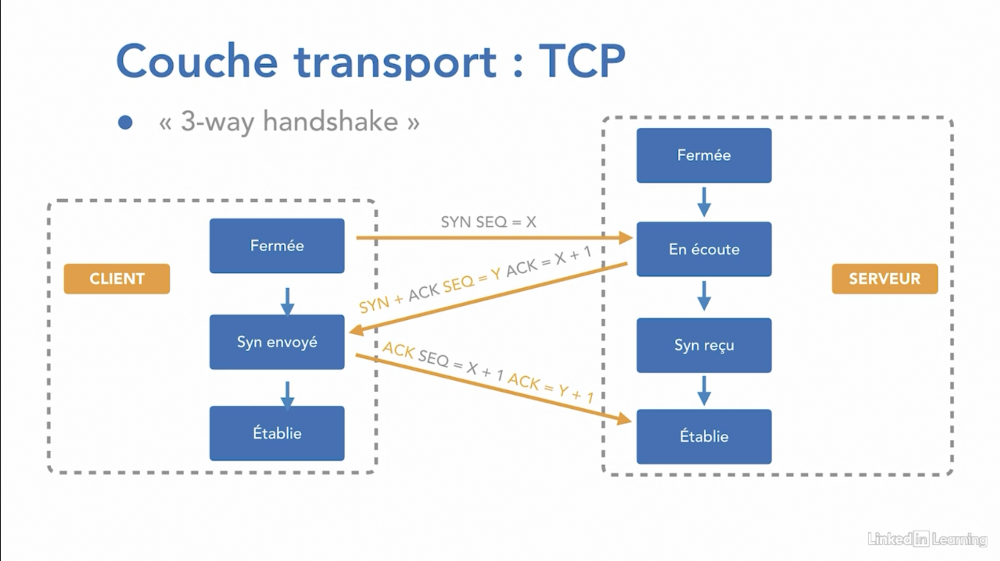
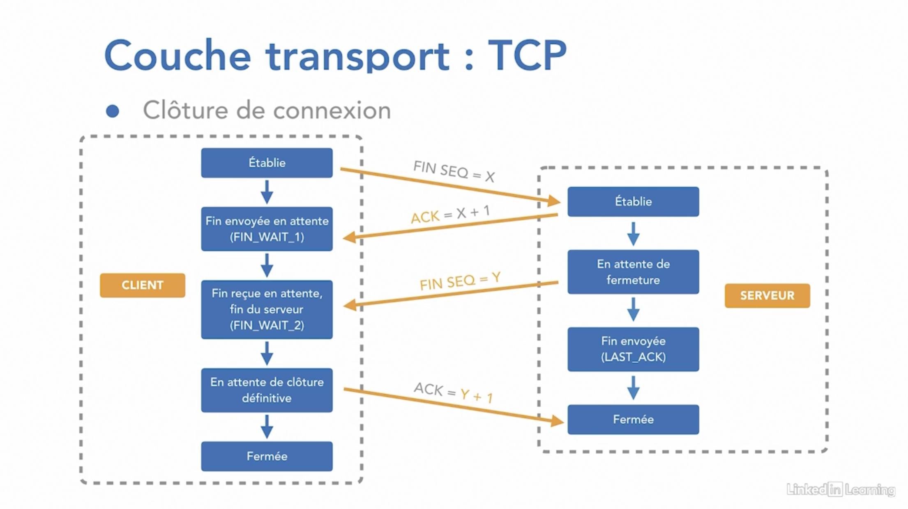
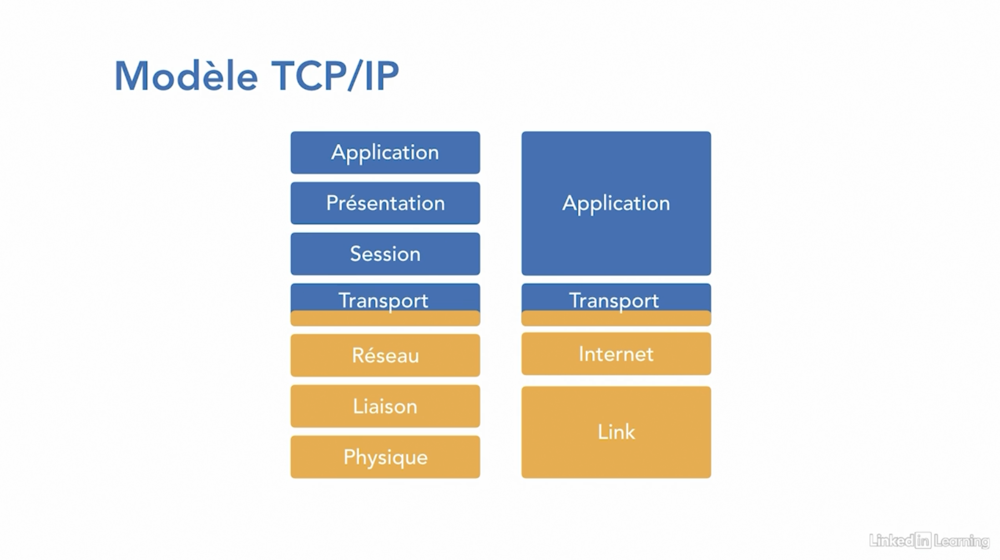

## Le rôle d'un protocole

C'est un ensemble de règles prédéterminées pour pouvoir communiquer entre des équipements/applications dans un réseau.

Il peut avoir une ou plusieurs fonctions selons les suivantes:

- Format et structure d'un format 
- Vérification des erreurs et règles de transmissions
- Comment se partager des médias entre les périphériques
- Comment paramétrer une session (démarrage et arrêt)

## Modèle OSI

Le modèle OSI est un modèle théorique qui permet de schématiser par 7 couches inter-dépendantes représentantes tout le processus d'interconnexion dans un réseau.

On les appelles les couches protocolaires car voici ce que OSI représente:

- 7 Application : Interface entre utilisateur et Application. Permet l'usage d'un protocole à son niveau sans dépendre des protocoles sous-jacents. Cette couche permet également de vérifier que l'ensemble des cibles de communications sont identifiées et disponibles.

  Protocoles de cette couche : HTTP/HTTPS, RTP, POP, IMAP, SMTP, FTP

- 6 Présentation : Cette couche a pour objectif de gérer la présentation des données au sein de l'application finale. Elle va s'occuper de l'encodage nécessaire (ASCII, UTF-8...) et le langage HTML par exemple.

- 5 Session : Cette couche va gérer tout ce qui concerne les sessions, le démarrage et l'arrêt.

  Protocoles : SSL/TLS, NETBIOS

- 4 Transport: Cette couche va permettre de transporter les données entre l'OS et l'application. Il va s'occuper de la fragmentation, l'établissement des sessions et fiabiliser les connexions, multi-threads d'applications grâce aux ports.

- 3 Réseau

- 2 Liaison de donnée

- 1 Physique

### TCP

Le protocole TCP est un protocole de communication dit "orientée connexion". Avant qu'une communication soit possible, il requière l'établissement d'une session avec le correspondant. La phase d'établissement d'une session se fait grâce au principe du  3-way handshake.

- Contrôle de flux: Fenêtrage

## Routage

- Paquets nécessaires pour routage dynamique
- Pas de diffusion des broadcasts/multicasts
- Analyse de l'en-tête IP
- Possibilité d'ACL (Access Control List)
- Commutation
- QOS (Quality Of Service: Permet de prioriser un certain type de traffic au niveau de la bande passante)

## Liaison

La couche liaison est nécessaire pour :

- Faire le lien avec le matériel
- Gérer l'adressage physique (@mac) au niveau des cartes réseaux
- Formatage de la trame
  - 2 sous-couches
    - Couche MAC :  Comment les trames sont placer sur le media (Gestion des erreurs...)
    - Couche LLC : Comment découper les données transmises par la couche réseau

Les switch permettent une commutation efficace grâce aux ASIC (Application Specified Integrated Circuit)

## Physique

L'objectif de cette couche est d'envoyer et recevoir les signaux électriques (bits) au sein des inter-connexions grâce aux médias (câbles, ondes, fibre optique, infra-rouges, HUB).

- Modulation d'amplitudes
- Modulation de fréquence
- Modulation de phase

DCE: Data Communication Equipment

DTE: Data Terminal Equipment

## Couche TCP/IP

## Encapsulation

A chaque niveau du modèle OSI, les données vont être encapsulés afin d'envoyer de renseigner les données.

