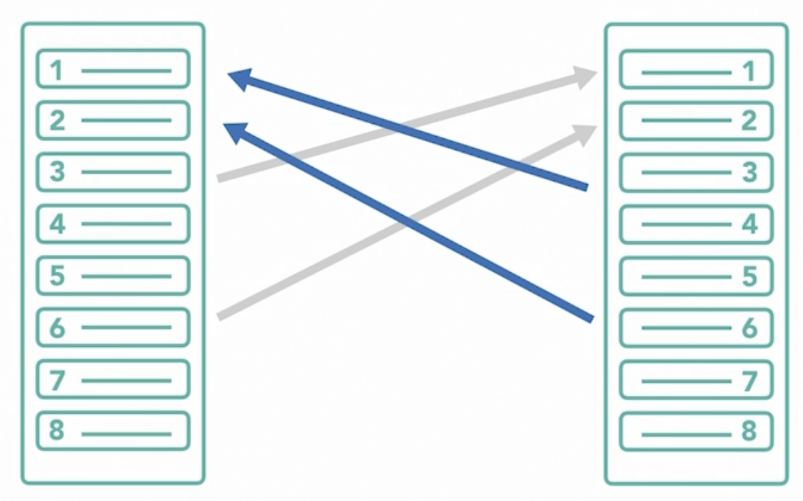
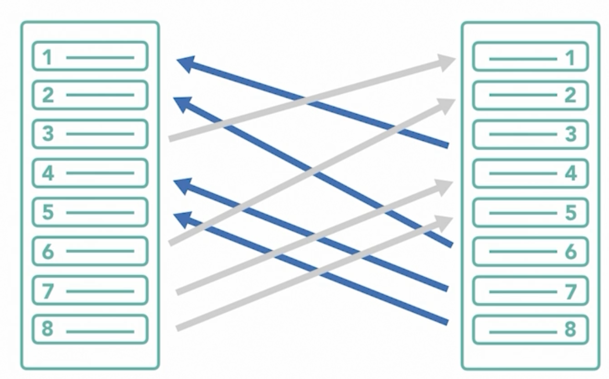

# **Protocole Ethernet**

- Il se trouve dans la couche liaison du modèle OSI ou Internet dans le modèle TCP/IP
- Normalisé selon la 802.3
- Permet de partager un média entre différentes machines
- Basé sur le CSMA/CD

### En-tête ethernet

Trames Ethernet 802.3 V2:

Préambule : 8 octets. Utilisé pour la synchronisation

Destination: 6 octets. Adresse physique de la carte réseau

Source : 6 octets. Adresse physique de la carte réseau

Type: 2 octets. Protocole de couche supérieure (IPv4/IPv6)

Données: 46 à 1500 octets. Données encapsulées

Contrôle de trames : 4 octets. CRC/CFS (Contrôle de Redondance Cyclique)

### Composition d'une adresse MAC

- Adresse au format hexadécimal (Base 16)
- Codée sur 48 Bits
- Format : 
  - Format original : 00:00:0C:00:00:01
  - Format Cisco : 0000.0C00.0001

Découpage d'une @mac

| I/G    | G/L    | IDENTIFIANT ORGANISATION (OUI) | ATTRIBUÉ PAR LE CONSTRUCTEUR |
| ------ | ------ | ------------------------------ | ---------------------------- |
| 1 BIT  | 1 BIT  | 22 BITS                        | 24 BITS                      |
| 0 ou 1 | 0 ou 1 | X0:00:0C                       | 00:00:01                     |
|        |        | CISCO                          | Périphérique spécifique      |

I/G : Individual Group Bit. Lorsque le bit est à 0, il représente l'adresse mac d'une machine unique. Autrement l'adresse mac désique un groupe de machine (Ex: @ Broadcast).

G/L: Global Local Bit, l'adresse mac est fournie par le constructeur lorsque le bit est à 1. Si le bit est à 0, c'est une adresse assignée manuellement par l'administrateur réseau.  

OUI : Organizationnaly Unique Identifier. Numéro unique attribué par l'IEEE pour chaque constructeur ou éditeur de solutions réseau. Source => [OUI Fournisseur IEEE](https://standards-oui.ieee.org/oui/oui.txt). Mis à jour régulièrement

### Normes filaires

- Conçu par DIX (Digital Intel Xerox) 
- 802.3 Ethernet
  - 802.3 U : FastEthernet
  - 802.3 AB : GigabitEthernet
  - 802.3 AN : 10 GigabitEthernet
  - 802.3 AE : Fibre et Coaxial
- 1983 Date de développement
- RJ45 (Registered Jack)
  - 10Base-T 802.3 Vitesse max 10Mbits/s / 100M
  - 100Base-TX 802.3 U FastEthernet. CAT 5 Rj45 100Mbits/s / 100M Distance max
  - 1000Base-CX 802.3z 1000Mbits/s / 25M 
  - 1000Base-T 802.3ab 1Gb/s / 100M max
  - 10Base-T 802.3an 10Gb/s 100M max

### Normes de câblage

- 3 Types de câbles Ethernet:

- Catégorie : Débit/Blindage
  - UTP 5e : 1Gbits / 100M
  - SFTP 6a : 10 Gbits / 100M
- Câbles droit : Périphériques non identiques
- Câble croisé : Périphériques équivalents et entre hub <-> Switch / PC <-> Router
- Câble rollover / Console pour pour administrer physiquement un équipement.
- Auto MDX : Les switchs de nouvelle génération incluent cette fonctionnalité qui permet de détecter le type de câble branché et permet logiquement de faire le croisement si nécessaire. Inutile dans la pratique aujourd'hui de faire attention au type de câble branchés entre chaque équipements.

Branchement d'un câble croisé FastEthernet avec 2 pairs

Branchement d'un câble GigabitEthernet avec 4 pairs 

### Les normes Ethernet pour la fibre optique

Les 2 types:

- Fibre monomode:
  - Laser
  - Hauts débits
  - Longues distances
  - Utilisé pour l'interconnexion entre villes / pays / continents
- Fibre multimode
  - Led
  - moins cher 
  - Débit/Distance moins élevé
  - Utilisé dans des petits réseaux

Les normes :

- 100Base-FX 802.3u: multimode/412m
- 1000Base-SX 802.3z: multimode/220m/550m
- 1000Base-LX 802.3z: monomode/10km
- 1000Base-ZX Cisco: monomode/70km

Pour interconnecter chaque extrémité d'une fibre monomode, on utilise des modules de type SFP/SFP+

==>  [Carte du globe avec les câbles sous-marin qui relient les continents](https://submarine-cable-map-2023.telegeography.com/)

#### Les notions à connaître pour l'examen

- Décrire le mécanisme de CSMA/CD
- Comprendre les différentes parties de l'adresse MAC
- Maîtriser la conversion binaire/décimale/hexadécimale
- Identifier les différents champs Ethernet
- Connaître les nromes de câblage Ethernet filaire/fibre
- Types de câbles

